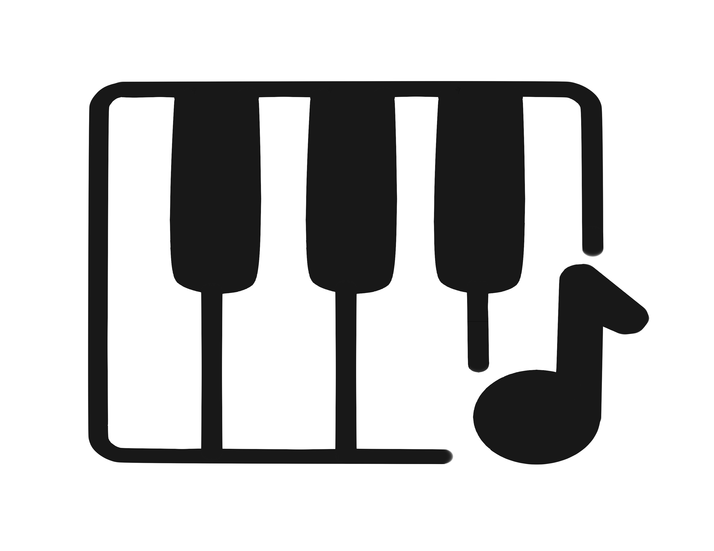

# 🎹 Virtual Piano

<div align="center">



</div>

A real-time virtual piano that parses MIDI files to synthesize rich, expressive piano tones using signal processing techniques. This project combines mathematics, programming, and music with 3D visualization to create an immersive and realistic piano experience.

## How It Works

- [Parses MIDI](Assets/Scripts/MIDIReader.cs) to extract note frequency, duration, and velocity, as well as track information and pedal info

- [Synthesizes sound](Assets/Scripts/Synth.cs) from pure waves to form harmonics, overtones and an ADSR envelope

- [Moves a 3D grand piano](Assets/Scripts/Key.cs) in real-time and has support for different [visual effects](Assets/Scripts/Effects.cs)

## How to Use

First, press `E` to set a MIDI file to play, then press `S` to start playing. Change effects or exit the program with the buttons on the bottom.

When playing MIDI, a few options are built-in:

| File name            | Song name                         | Composer               |
|----------------------|-----------------------------------|------------------------|
| `Fur Elise.mid`      | Für Elise                         | Ludwig van Beethoven   |
| `MS3.mid`            | Moonlight Sonata – Third Movement | Ludwig van Beethoven   |
| `The Entertainer.mid`| The Entertainer                   | Scott Joplin           |
| `Bourree.mid`        | Bourree BWV 996 (Suite in E Minor)| Johann Sebastian Bach  |
| `Canon in D.mid`     | Canon in D Major                  | Johann Pachelbel       |
| `Turkish March.mid`  | Rondo alla Turca (Turkish March)  | Wolfgang Amadeus Mozart|


Or, reference the file path your own MIDI file.

## Installation
### Install from Release
Download the latest version of the Virtual Piano from the Releases Page. Unizip the folder, and run the `Virtual Piano` executable.

### Build from Source
> Created for Unity Game Engine version 6000.4.2f1

Clone the repository:
```bash
git clone https://github.com/Ezlanding1/Virtual-Piano.git
```
Open the project in the Unity editor, and press play.

## Media

